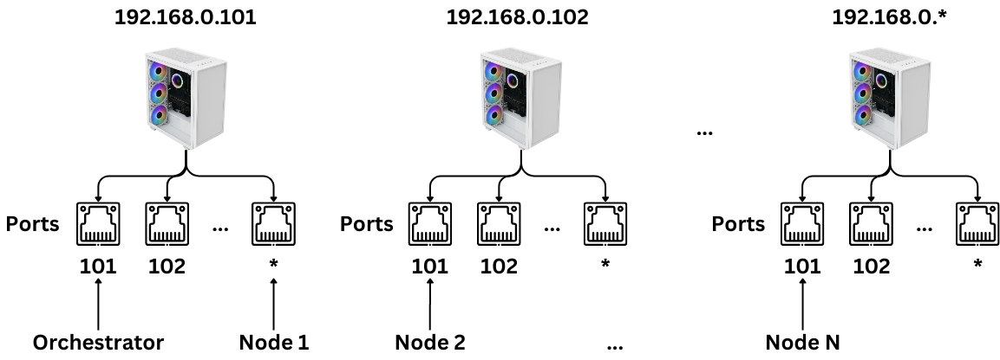

# Traversal Learning (TL) for Lossless and Efficient Distributed Learning



This repository contains the full source code for Traversal Learning, along with a comparative centralized learning baseline, enabling researchers and developers to replicate experiments and explore the benefits of TL.

## Architecture

The Traversal Learning system is composed of two primary components:

1.  **Orchestrator**: The central server that manages connections, creates virtual batches, orchestrates forward passes on nodes, collects necessary activations and gradients, performs centralized backward propagation, and updates the global model.
2.  **Node**: The distributed clients that hold local data, perform a partial forward pass on their assigned data subsets, compute specific local gradients, and send these to the orchestrator.

## Installation

### Prerequisites

* Python 3.8+
* PyTorch
* NumPy
* Zlib (usually built-in with Python)

### Setup Steps

1.  **Clone the repository**:
    ```bash
    git clone [https://github.com/your-username/Traversal-Learning.git](https://github.com/your-username/Traversal-Learning.git)
    cd Traversal-Learning
    ```
2.  **Create a virtual environment (recommended)**:
    ```bash
    python -m venv venv
    source venv/bin/activate  # On Windows, use `venv\Scripts\activate`
    ```
3.  **Install dependencies**:
    ```bash
    pip install torch torchvision numpy
    ```
    (Ensure your PyTorch installation is compatible with your CUDA version if using a GPU.)

## Usage

### 1. Run the Orchestrator

Open a terminal and start the orchestrator:

```bash
python orchestrator/main.py --num_nodes <number_of_nodes> --epochs <num_epochs> --batch_size <batch_size> --lr <learning_rate> --gamma <gamma_for_scheduler> [--no-accel]
```

Example:

```bash
python orchestrator/main.py --num_nodes 3 --epochs 10 --batch_size 64 --lr 0.01 --gamma 0.7 --host 127.0.0.1 --port 12345
```

Arguments:

* <code>--num_nodes</code>: Number of expected client nodes to connect.
* <code>--epochs</code>: Number of training epochs.
* <code>--batch_size</code>: Global batch size for training.
* <code>--lr</code>: Initial learning rate for the optimizer.
* <code>--gamma</code>: Multiplicative factor for learning rate decay.
* <code>--host</code>: (Optional) Host address for the orchestrator server (default: 127.0.0.1).
* <code>--port</code>: (Optional) Port for the orchestrator server (default: 12345).
* <code>--no-accel</code>: (Optional) Use CPU even if an accelerator (GPU) is available.

### 2. Run the Nodes

Open separate terminals for each node you want to run (equal to <code>--num_nodes</code> specified for the orchestrator).

```bash
python node/main.py --node_id <node_id> --host <orchestrator_host> --port <orchestrator_port> --num_nodes <total_num_nodes> [--no-accel]
```

Example (for Node 0, connecting to the above orchestrator):

```bash
python node/main.py --node_id 1 --host 127.0.0.1 --port 12345 --num_nodes 3
```

Arguments:

* <code>--node_id</code>: A unique identifier for this node (0, 1, 2, ...).
* <code>--host</code>: Host address of the orchestrator.
* <code>--port</code>: Port of the orchestrator.
* <code>--num_nodes</code>: Total number of nodes participating in the training (must match orchestrator's --num_nodes).
* <code>--no-accel</code>: (Optional) Use CPU even if an accelerator (GPU) is available.

### 3. Run Centralized Baseline (for comparison)

To run the centralized version for comparison or to verify identical results to TL:

```bash
python centralized.py --epochs <num_epochs> --batch_size <batch_size> --lr <learning_rate> --gamma <gamma_for_scheduler> --seed <random_seed> [--no-accel]
```

Example:
```bash
python centralized.py --epochs 10 --batch_size 64 --lr 0.01 --gamma 0.7 --seed 1 --log-interval 100
```

Arguments:

* <code>--epochs</code>: Number of training epochs.
* <code>--batch_size</code>: Batch size for training.
* <code>--lr</code>: Initial learning rate.
* <code>--gamma</code>: Multiplicative factor for learning rate decay.
* <code>--seed</code>: Random seed for reproducibility (crucial for comparing with TL's virtual batch creation).
* <code>--no-accel</code>: (Optional) Use CPU even if an accelerator (GPU) is available.
* <code>--log-interval</code>: (Optional) How many batches to wait before logging training status (default: 10).

## Citation

If you use Traversal Learning in your research, please cite the following paper:

```bash
@article{batbaatar2025traversal,
  title={Traversal Learning Coordination For Lossless And Efficient Distributed Learning},
  author={Batbaatar, Erdenebileg and Kim, Jeonggeol and Kim, Yongcheol and Yoon, Young},
  journal={arXiv preprint arXiv:2504.07471},
  year={2025}
}
```

## License

This project is licensed under the MIT License.
